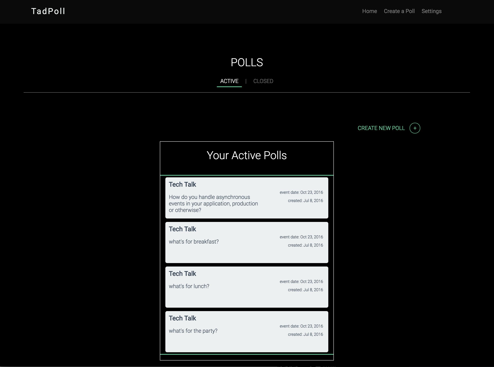

# TadPollNG
Refactored TadPoll in Angular 2 with BDD

Refactoring previous TadPoll project from ReactJS to Angular 2, bringing in BDD with Karma/Jasmine

## Tech Stack:
* Angular 2
* Ruby on Rails (anticipated backend, Node as alternative)
* Websockets
* D3
* RxJS

## Screenshots (Project in progress)

## Artboards / Wireframes (with Adobe Experience Design):
#### Dashboard mock

#### Presentation View mock

#### Single Poll Detail mock

#### Question/Poll Creation mock

## Development server
Run `ng serve` for a dev server. Navigate to `http://localhost:4200/`. The app will automatically reload if you change any of the source files.

## Code scaffolding

Run `ng generate component component-name` to generate a new component. You can also use `ng generate directive/pipe/service/class`.

## Build

Run `ng build` to build the project. The build artifacts will be stored in the `dist/` directory. Use the `-prod` flag for a production build.

## Running unit tests

Run `ng test` to execute the unit tests via [Karma](https://karma-runner.github.io).

## Running end-to-end tests

Run `ng e2e` to execute the end-to-end tests via [Protractor](http://www.protractortest.org/).
Before running the tests make sure you are serving the app via `ng serve`.
